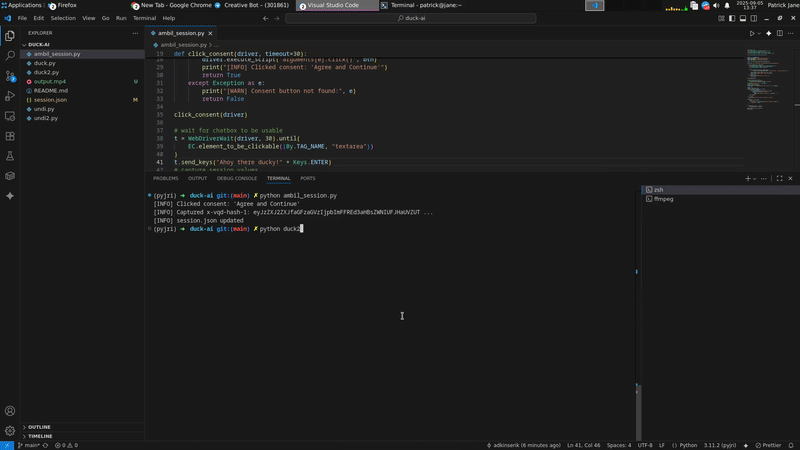

# if nothing works, you can always have selenium
...

...

First, get some session with ```python ambil_session.py```
If there is session.json and the session is not empty,
Then, ```python duck2.py```

Let me know, when its stop working.
  PS. the code itself coded by Ducky
